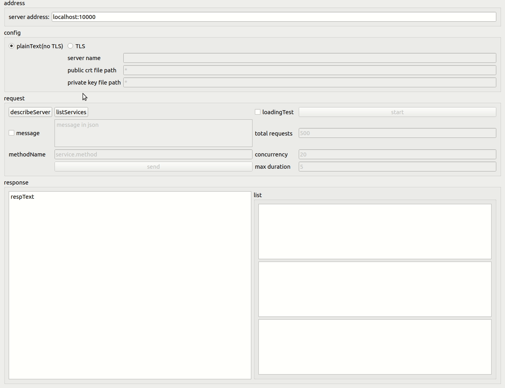

#

## Simple gRPC client with Qt

main features are from cmd line tool [grpcurl](https://github.com/fullstorydev/grpcurl), MIT license

and [ghz](https://github.com/bojand/ghz), Apache-2.0 license

**reminder:**

Target server should open `reflection` by including `google.golang.org/grpc/reflection` package.
You can find more details in demo [server](server/server.go).

Since the message treat nested json as a string, you may need the following online conversion tools:
[JSON to string online converter](https://tools.knowledgewalls.com/jsontostring)
[Delete All Whitespace Characters](https://www.browserling.com/tools/remove-all-whitespace)

